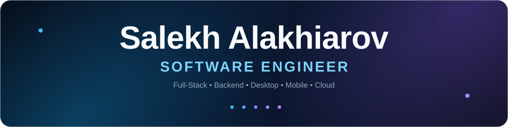
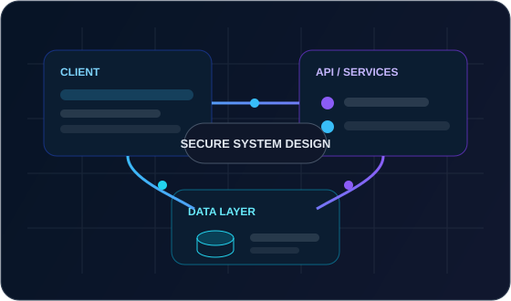
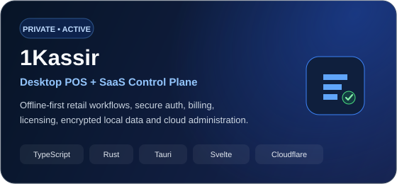
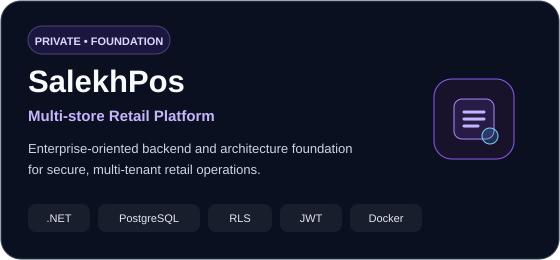
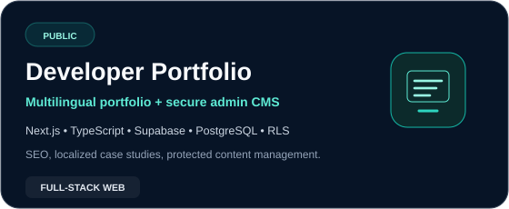
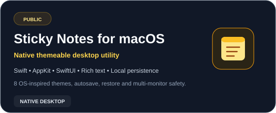
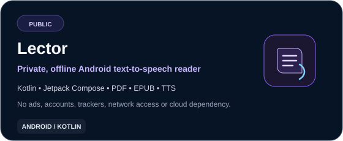

<div align="center">



<br />

<a href="https://readme-typing-svg.demolab.com">
  
</a>

<br />

<a href="https://www.linkedin.com/in/salekhalakhiarov/">
  
</a>
&nbsp;
<a href="mailto:salekh.alakhiarov968@hum.tsu.edu.ge">
  
</a>
&nbsp;
<a href="https://github.com/AlakhiarovSalekh?tab=repositories">
  
</a>

<br /><br />

<sub><b>Tbilisi, Georgia</b> &nbsp;•&nbsp; Open to remote opportunities worldwide</sub>

</div>

---

## About Me

<table>
<tr>
<td width="57%" valign="top">

I'm a **Full-Stack Software Engineer** with **3+ years of software development experience**, building end-to-end software across **web, backend, desktop, mobile, databases, and cloud infrastructure**.

I care about the parts of engineering that make software dependable after the demo: **architecture, security, data integrity, offline behavior, authorization, performance, testing, deployment, and maintainability**.

My work spans product interfaces, APIs, authentication systems, relational databases, encrypted local storage, SaaS control planes, billing integrations, desktop applications, mobile apps, and CI/CD.

### What I optimize for

- **Complete product ownership** — from UI and API contracts to data and deployment
- **Security by design** — authentication, authorization, session safety, data boundaries
- **Reliable data** — transactions, migrations, audit trails, idempotency, consistency
- **Offline-first systems** — local persistence, synchronization, recovery, resilience
- **Maintainable architecture** — clear boundaries, testability, typed contracts
- **Production discipline** — automated checks, CI/CD, release verification

</td>
<td width="43%" valign="top" align="center">



</td>
</tr>
</table>

---

## Engineering Snapshot

| Area | What I work on |
|---|---|
| **Full-Stack Product Engineering** | End-to-end product development across frontend, backend, data, integrations, and delivery |
| **Backend & API Architecture** | REST APIs, authentication, authorization, sessions, business workflows, external integrations |
| **Desktop & Offline Systems** | Cross-platform desktop applications, encrypted local databases, offline workflows, sync and recovery |
| **Cloud & SaaS Infrastructure** | Cloud APIs, account systems, subscriptions, entitlements, webhooks, admin control planes |
| **Database Engineering** | PostgreSQL, SQLite / SQLCipher, schema design, migrations, transactional workflows, access boundaries |
| **Security Engineering** | RBAC, scoped permissions, RLS, replay/idempotency protections, audit trails, secure secret handling |
| **Delivery & Quality** | Type safety, automated tests, GitHub Actions, CI/CD, build verification and release discipline |

---

## Technology Stack

<div align="center">


<br />


<br />


</div>

### Primary engineering stack

| Layer | Technologies |
|---|---|
| **Frontend** | TypeScript, JavaScript, React, Next.js, Svelte, HTML, CSS, Tailwind CSS |
| **Backend** | Node.js, REST APIs, ASP.NET Core / .NET, Python |
| **Desktop / Systems** | Rust, Tauri, C#, C++, Swift, AppKit, SwiftUI |
| **Mobile** | Kotlin, Android, Jetpack Compose |
| **Databases** | PostgreSQL, SQLite, SQLCipher, MySQL, MongoDB |
| **Cloud / Delivery** | Cloudflare, Docker, GitHub Actions, CI/CD |
| **Product Infrastructure** | Authentication, authorization, sessions, billing, entitlements, webhooks, audit logging |

<details>
<summary><b>More technologies I've worked with</b></summary>

<br />

Java, PHP, Express.js, PyQt5, Bootstrap, jQuery, Ajax, Android native APIs, local persistence, payment integrations, localization, background workflows, and cross-platform application architecture.

</details>

---

## Current Product Work

<table>
<tr>
<td width="50%" valign="top">



### 1Kassir

A **desktop-first Point-of-Sale and SaaS platform** being built for small shops, combining secure local retail operations with a cloud control plane.

**Selected engineering areas**

- Tauri 2 + Rust desktop architecture
- Svelte 5 / TypeScript application UI
- SQLCipher encrypted local database
- Offline sales, inventory, returns, receipts and cash sessions
- Device-bound authorization and entitlement enforcement
- Next.js website and account experience
- Cloudflare control-plane APIs and data
- Paddle subscription and webhook lifecycle
- Authentication, session rotation, audit history and account security
- Automated TypeScript / Rust verification in CI

**Status:** Private repository · Active development

</td>
<td width="50%" valign="top">

<a href="https://github.com/AlakhiarovSalekh/SalekhPos">
  
</a>

### SalekhPos

A larger **multi-store retail platform architecture** focused on secure organization, branch, identity, authorization and data foundations.

**Implemented foundation includes**

- .NET / ASP.NET Core backend
- PostgreSQL data architecture
- Row-Level Security boundaries
- JWT-protected scoped access
- Organization / branch models
- Membership and permission scopes
- Durable token revocation
- Immutable audit records
- Protected root-authority administration
- Integration and HTTP verification

**Status:** Public repository · Architecture / backend foundation

<a href="https://github.com/AlakhiarovSalekh/SalekhPos"><b>Explore SalekhPos repository →</b></a>

</td>
</tr>
</table>

---

## Selected Public Work

<table>
<tr>
<td width="33%" valign="top">

<a href="https://github.com/AlakhiarovSalekh/SalekhPortfolio">
  
</a>

**Developer Portfolio**  
A multilingual, production-oriented portfolio foundation with **Next.js, TypeScript, Supabase, PostgreSQL, RLS, localized case studies, and protected admin architecture**.

<a href="https://github.com/AlakhiarovSalekh/SalekhPortfolio"><b>Explore repository →</b></a>

</td>
<td width="33%" valign="top">

<a href="https://github.com/AlakhiarovSalekh/Sticky-Notes-macOS-">
  
</a>

**Sticky Notes for macOS**  
A native macOS utility built with **Swift, AppKit and SwiftUI**, featuring rich text, autosave, restoration, multi-monitor protection and eight OS-inspired themes.

<a href="https://github.com/AlakhiarovSalekh/Sticky-Notes-macOS-"><b>Explore repository →</b></a>

</td>
<td width="33%" valign="top">

<a href="https://github.com/AlakhiarovSalekh/Lector">
  
</a>

**Lector**  
A private-by-design offline Android reader using **Kotlin and Jetpack Compose** for TXT, Markdown, EPUB and PDF text-to-speech workflows without ads, accounts or network access.

<a href="https://github.com/AlakhiarovSalekh/Lector"><b>Explore repository →</b></a>

</td>
</tr>
</table>

<div align="center">

<a href="https://github.com/AlakhiarovSalekh?tab=repositories">
  
</a>

</div>

---

## What I Build

<table>
<tr>
<td width="33%" valign="top">

### Web Platforms
Responsive applications, account systems, admin experiences, authentication, localization, SEO, APIs and database-backed workflows.

</td>
<td width="33%" valign="top">

### Backend Systems
Secure APIs, authorization, transactional business logic, relational data, webhooks, auditability and third-party integrations.

</td>
<td width="33%" valign="top">

### Desktop Software
Cross-platform and native applications with local persistence, offline behavior, encrypted data, printing and business workflows.

</td>
</tr>
<tr>
<td width="33%" valign="top">

### Mobile Apps
Native Android and Apple-platform applications focused on usability, offline functionality and platform-native capabilities.

</td>
<td width="33%" valign="top">

### SaaS Infrastructure
Accounts, subscriptions, trials, feature entitlements, device management, customer portals and lifecycle automation.

</td>
<td width="33%" valign="top">

### Engineering Foundations
Architecture, security boundaries, CI/CD, tests, migrations, performance, recovery and maintainability.

</td>
</tr>
</table>

---

## GitHub Analytics

<div align="center">


<br />


</div>

---

## Engineering Principles

```text
01  Security is part of the architecture, not a final checklist.
02  Data integrity matters more than optimistic UI.
03  Offline behavior should be designed, not improvised.
04  Authorization belongs at trusted boundaries.
05  Critical writes should be transactional and idempotent.
06  Tests and CI are part of delivery, not optional polish.
07  Maintainability is a product feature for the next engineer.
08  Build the smallest system that can remain correct as it grows.
```

---

## Current Focus

I'm currently focused on building **production-oriented retail and SaaS software**, with particular attention to:

- cross-platform desktop engineering
- secure authentication and authorization
- offline-first transactional systems
- relational database architecture
- subscription and entitlement infrastructure
- cloud APIs and deployment
- application security
- system design and distributed-system fundamentals

I'm also open to **remote Full-Stack Software Engineer, Software Engineer, Backend Engineer, and Product Engineer opportunities** where I can contribute across the complete product lifecycle.

---

## Connect With Me

<div align="center">

### Have an engineering opportunity, project, or product to discuss?

<br />

<a href="https://www.linkedin.com/in/salekhalakhiarov/">
  
</a>
&nbsp;
<a href="mailto:salekh.alakhiarov968@hum.tsu.edu.ge">
  
</a>
&nbsp;
<a href="https://github.com/AlakhiarovSalekh">
  
</a>

<br /><br />

<sub>Tbilisi, Georgia &nbsp;•&nbsp; Open to remote opportunities worldwide</sub>

<br />


</div>

<!-- Profile README redesigned 2026-10-04 -->
